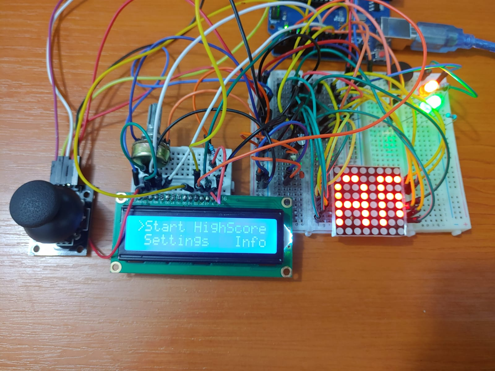
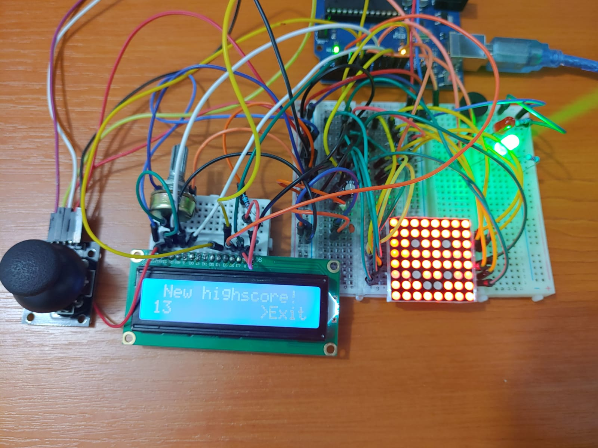
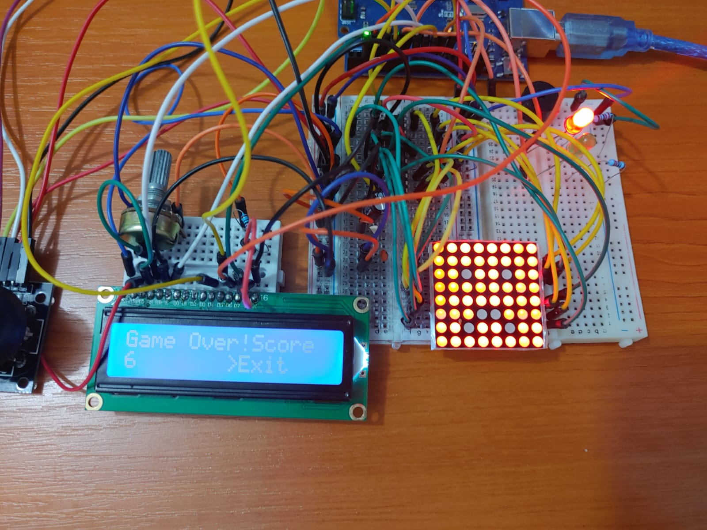

# RACING GAME

## **1. Description**

Racing Game is a single player game. The player, represented on the matrix as a blinking point, must avoid the red lights on the matrix. The red lights will look like two walls, and the player must slip through them. When the player hits the wall, he loses a life, the game stops for a short period of time, the number of lives remaining will be displayed on the matrix, then the game will start. When the player loses all 3 lives, he loses the game and a message will be displayed on the matrix.

You can see a demo here: https://youtu.be/P7bDNxj5xQ8

## **2. Hardware**
- Arduino uno
- 2 medium-sized breadboards
- 1 small breadboard
- 8x8 LED matrix
- MAX7219 Driver
- 1 electrolytic capacitor of 10μF
- 1 ceramic capacitor of 104pF
- LCD
- 1 potentiometer
- 1 buzzer
- a green LED
- a red LED
- Joystick
- 3 220 ohm resistors
- 1 10K ohm resistor
- wires

## **3. Game specifications**
 - Welcome
 After you turn on the Arduino Uno board, a "Welcome!" message will be displayed on the matrix and "Racing Game, Have fun!" on the LCD for 10 seconds.
 - Start Game
As long as the game has not started, the text "START GAME" will be written on the matrix. Both green and red led will be turned on (except when you finish the game).

 ***Main Menu***
 
 The Main Menu contains the following options:
  1. Start
  2. HighScore
  3. Settings
  4. Info
  
  Now you can scroll through the menu (displayed on the LCD) with the joystick. In order to move between the options you move the joystick left-right (on the OY axis). ONLY in the Main Menu (here) you can select an option by pressing the button of the joystick or by moving it on the OX AXIS(up or down). 
  
  ***Start***
  
  After pressing "Start" option, the possible difficulties of the game will appear on the LCD: "Easy", "Medium", "Hard". You can scroll through them by moving the joystick on the OY axis (left-right) and select one by pressing the button of the joystick. After selecting an option, the game will start. 
 
 
  ***HighScore***
  
  It contains:
  1. the highest score ever obtained by a player (saved in EEPROM)
  2. the name of the player that obtained the highest score, which is set in settings (saved in EEPROM)
  3. exit
  You can go back in the Main Menu only by pressing the button of the joystick
  
  ***Settings***
  
  The Settings Menu contains:
  1. the name 
  2. exit
  You can select an option moving the joystick up and down (on the OX axis). PAY ATTENTION! To modify the name you should press the button when ">" is set before "Name". To go back int the Main Menu you should press the button  when ">" is set before "Exit".
  Setting the name:
  After you have selected name in order to modify it (by pressing the button) you can do the following:
  - move left - right to know which letter you want to modify (the selected one will be purple)
  - move up - down to change the letter. Between A and Z it is " "
   Name has a maximum of 7 letters and the default name is "PLAYER ".
  
  ***Info***
  
  It contains:
  1. the name of the game (Racing Game)
  2. the creator name (Cozma Laura)
  3. Github link of the creator
  4. @UnibucRobotics (that helped me to create the game)
  5. exit
  You can scroll up and down using the OX axis. You can go back in the Main Menu only if the cursor ">" is set before "Exit" and you push the button.
  
  ## **4. How to play**
  
The player is represented by a blinking bullet, on both sides of it being walls. During the game the player must move using the left and right movements of the joystick, because the walls are canging constantly. When starting the game you have 3 lives and the score is 0. There are 3 speed thresholds and at certain time intervals it increases by 100 ms. 

***Game difficulty***

Easy: the initial speed is 600ms, the width of the path is 4 leds, at every step the score is increased by 1
Medium: the initial speed is 400ms, the width of the path is 3 leds, at every step the score is increased by 2
Hard: the initial speed is 300ms, the width of the path is 3 leds, at every step the score is increased by 3

***Loosing a life***

When the player loses a life, the game stops for 4 seconds and the player can choose his position (left - right movements).

***Loosing the game***

The player loses the game when there is no life left. If he has exceeded the highscore, "New highscore" will appear on the LCD, a smiley face on the matrix and the green led will turn on. Otherwise, "Game over! Score" will appear on the LCD, a sad face on the matrix and the red will turn on. You can quit by pressing the button. After that, the player will be asked if he wants to try again or to to exit (and go in the main menu). If he wants to try again, he should select again the difficulty level and the game restarts.

***Getting an extra life***

During the game, the player can hear a sound (only 3 seconds) up to 3 times. If he pressed the button in those 3 seconds, he gets an extra life.

***Game implementation***

The walls are generated randomly, we keep the position from where the road starts, and the random number tells us if the road continues to the left or to the right. The matrix will change every speedPlayer seconds, so the player will go down one row. 
